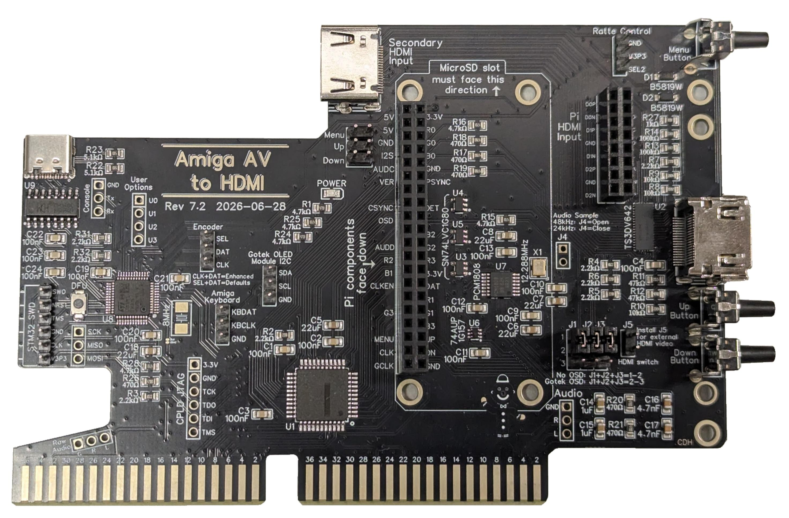
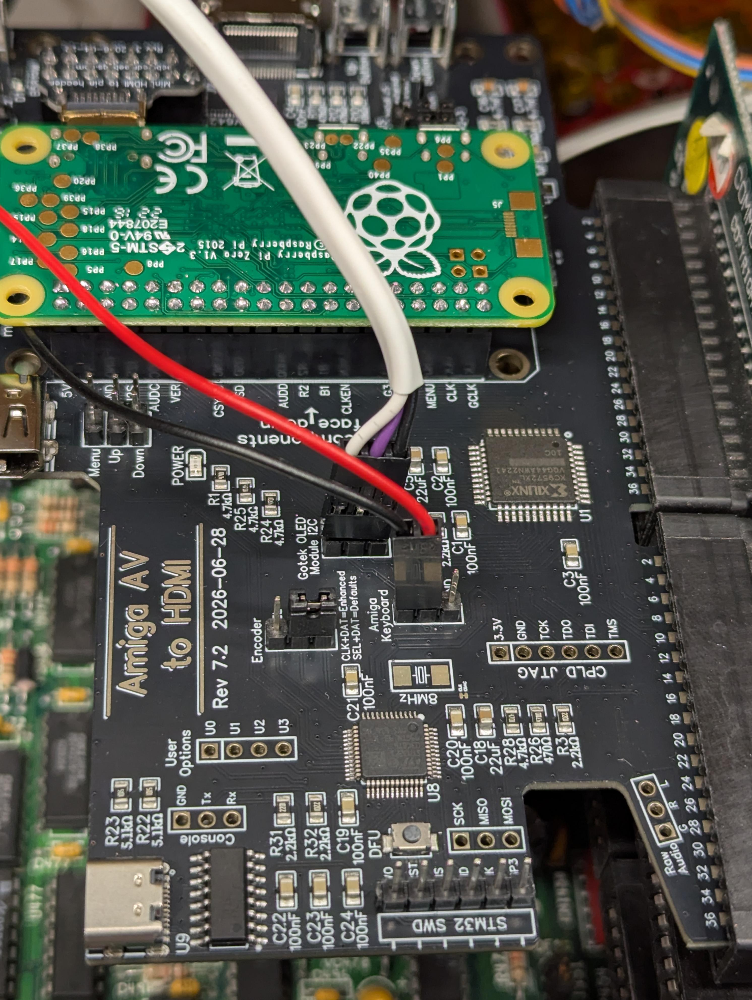

# Amiga AV to HDMI

The **Amiga AV to HDMI** board is an open-source video, audio, and
FlashFloppy interface for big-box Amiga computers (A2000, A3000, etc).
It plugs into the Amiga Video Slot and converts to HDMI usign a
Raspberry Pi running [RGBtoHDMI](https://github.com/hoglet67/RGBtoHDMI).

Features:

- **Raspberry Pi HDMI output** using the RGBtoHDMI software.
- **HD Audio capture**, allowing Amiga audio to be included.
- **Integrated FlashFloppy OSD**, providing an on-screen display for FlashFloppy and allowing Amiga keyboard to control FlashFloppy.
- **HDMI switching**, the Pi HDMI or a second HDMI video source can be selected for output.
- **Rear-facing HDMI output**, allowing full size attachment of HDMI to your Amiga.
- **USB-C console** to configure or program FlashFloppy OSD

The board is designed for the A2000 and A3000 Video Slot. It also works with the A4000, but is limited to 12-bit capture of the AGA 24-bit video, and only with OCS video modes.

## Documentation

| Document | Description |
| --- | --- |
| [Hardware Build Guide](doc/hw_build.md) | Building the PCB and component soldering guide. |
| [Amiga Installation](doc/amiga_install.md) | Assembling the Pi, HDMI adapter, and AV to HDMI boards, setting jumpers, and installing in your Amiga. |
| [Hardware Configuration](doc/hw_config.md) | CPLD programming, Pi setup, including Audio and FlashFloppy OSD. |
| [FlashFloppy OSD](doc/flashfloppy_osd.md) | Installing and configuring the custom FlashFloppy OSD firmware. Keyboard control keystrokes are also covered. |
| [Troubleshooting](doc/troubleshooting.md) | Diagnostic information for common installation and operating problems. |
| [Hardware Revisions](doc/hw_revisions.md) | Hardware revision history and the major differences between revisions. |
| [Hardware Architecture](doc/hw_architecture.md) | Hardware architecture of the Amiga AV to HDMI board. |

## Raspberry Pi software

The Raspberry Pi runs the multi-platform vintage-hardware [RGBtoHDMI](https://github.com/hoglet67/RGBtoHDMI) software, which does Amiga video conversion to HDMI.

Consult the RGBtoHDMI documentation for Raspberry Pi software installation, SD-card preparation. As detailed in the [Hardware Configuration](doc/hw_config.md) document, it is recommened that you use "Amiga 2000" for the profile, and "Amiga 2000 60Hz" or "Amiga 2000 50 Hz" for the Sub-Profile.

## FlashFloppy OSD software

The STM32F103 firmware used by this board is maintained separately:

[cdhooper/flashfloppy-osd-avhdmi](https://github.com/cdhooper/flashfloppy-osd-avhdmi)

This is a board-specific fork of [keirf/flashfloppy-osd](https://github.com/keirf/flashfloppy-osd). It provides:

- FlashFloppy OSD output on the Pi's HDMI display.
- Optional Amiga keyboard control of FlashFloppy and the OSD.

See [FlashFloppy OSD](doc/flashfloppy_osd.md) for board-specific installation and configuration instructions.

## Installing in an Amiga

The board is intended to plug directly into the Amiga Video Slot. The Raspberry Pi and HDMI hardware are mounted on the board so that the HDMI connection is made from the rear of the computer.

See [Amiga Installation](doc/amiga_install.md) for installation details.

## Quick Start Guide

1. **Prepare the MicroSD Card:**
   - Download the latest release from [RGBtoHDMI Releases](https://github.com/hoglet67/RGBtoHDMI/releases).
   - Format a MicroSD card as FAT32 and extract the release files to the root directory.
2. **Attach the Raspberry Pi:**
   - Connect your Pi Zero to the Pi HDMI adapter, and seat them together on the Amiga AV to HDMI board.
3. **Install into the Amiga:**
   - Power off your Amiga.
   - Insert the adapter firmly into the Video Slot.
4. **Connect & Power on:**
   - Connect a Mini-HDMI to HDMI cable from the board to your monitor.
   - Power on the Amiga. On first boot, open the RGBtoHDMI OSD using the rear buttons to select the appropriate Amiga video profile.

## Open-source hardware

This project is intended to be buildable from the published hardware design files. When reproducing a board, use the schematic, PCB layout, BOM, and revision documentation together. Do not mix components or configuration information between revisions without checking the electrical design.

## License

See the [license file](LICENSE.md) included in this repository and in the component projects linked above.
