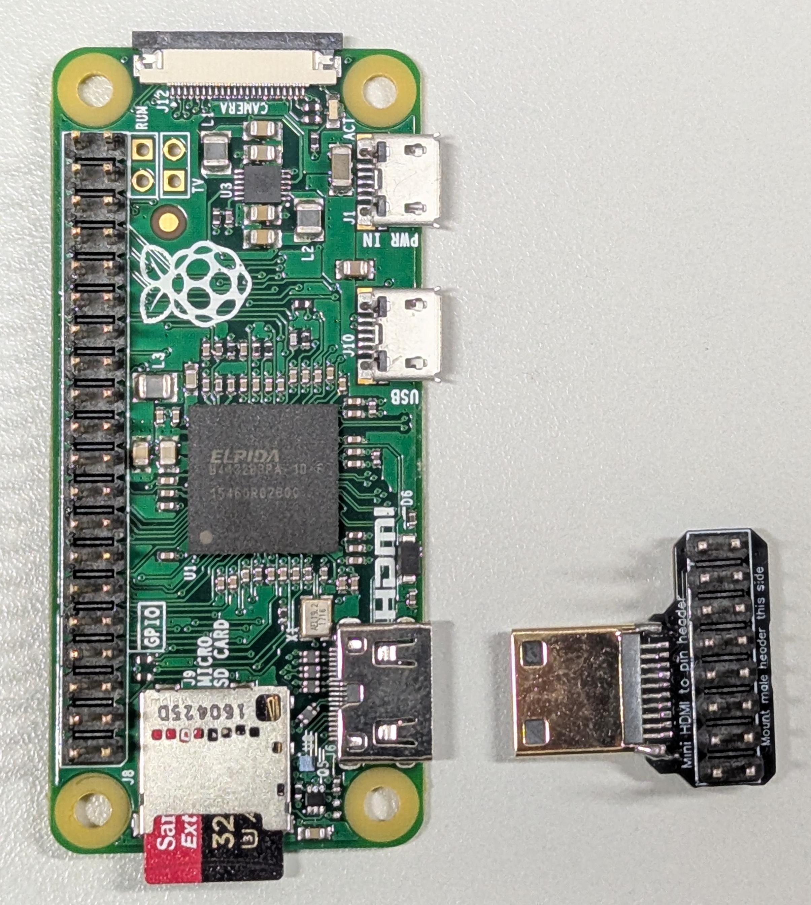
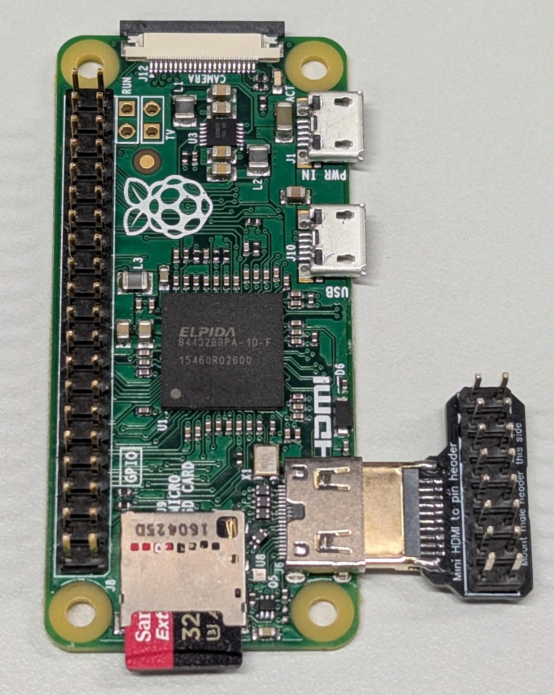
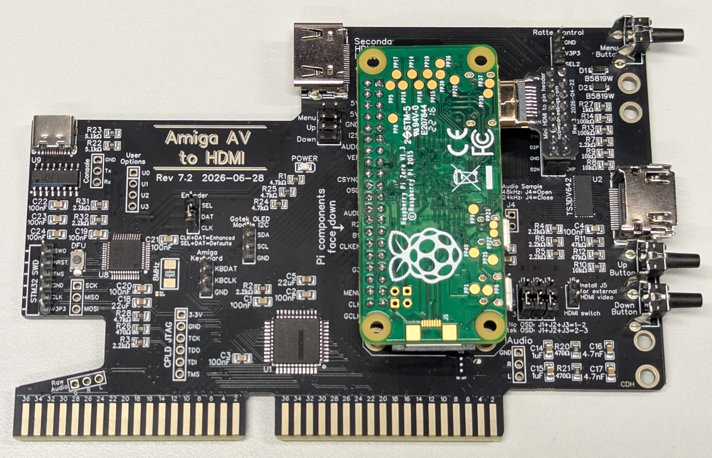

# Amiga Installation

The Amiga AV to HDMI board is designed for the big-box Amiga Video Slot.

Supported systems include:

- Amiga 2000.
- Amiga 3000.
- Amiga 3000T.
- Amiga 4000, with the video limitations described below.
- Amiga 4000T, with the video limitations described below.
- Other reimplemented Amiga models which have a video slot such as A4000TX and AmigaPCI.

### A2000/A3000

The A2000 and A3000 are the primary target systems.

The board captures the native digital Amiga video through the Video Slot and sends it to the Raspberry Pi for RGBtoHDMI processing.

### A4000 limitations

The board also works with the A4000, but it is limited to:

- 12-bit video. The A4000 chipset supports 24-bit video, which will have shading clipped slightly, but will still work fine with capture at 12-bit.
- OCS resolution screen modes.

Do not expect AGA display modes to work, as they are typically at a faster
bit rate than what the RGBtoHDMI can capture.

## 1. Install the adapter PCB on the Raspberry Pi

The Rev7 design allows HDMI from the Pi to be captured without using
a cable. Instead, a separate tiny [adapter board](../rev6_adapter_4/)
is required. This adapter board has two connectors (HDMI male and male
2x8 Dupont male header). It should be plugged in to the Raspberry Pi,
and then both the Pi and the adapter will be plugged in to the
Amiga **AV to HDMI board** at the same time.

Set the Pi and adapter board face up on your desk

Plug the adapter board into the Pi.

## 2. Install the Raspberry Pi on the Amiga AV to HDMI

Install the Raspberry Pi only after confirming the orientation for the specific PCB revision. Incorrect orientation can cause electrical or mechanical damage.
The Raspberry Pi must be installed face-down on current revision boards.

Install both the Pi in the 2x20 pin socket and the adapter in the 2x8 pin socket at the same time.

Verify that pins both connectors are fully seated and that neither connector is off a row or column of pins.

### Pi Zero or Pi Zero 2

The Amiga AV to HDMI is designed around a Raspberry Pi Zero for RGBtoHDMI processing. The Pi connects to the board through the GPIO connector and supplies the processing platform for the RGBtoHDMI software. There is no major advantage in choosing the Pi Zero 2 over the Pi Zero 1.3.

## 3. Set Amiga AV to HDMI jumpers

1. You must install a jumper at each of J1, J2, and J3. If you plan to use the FlashFloppy OSD, install them in the 2-3 position (recommended). Otherwise, you can install them in either 1-2 or 2-3. The advantage to 1-2 is that the Pi will not need to (automatically) overclock to capture audio.
2. If you want to force video from the secondary HDMI Input on the rear connector, install jumper J5. This is usually done just for debug. If you have a board which offers Ratte control, you can also attach a cable to the Ratte Control header at the top of the board.
3. Install a jumper between DAT and CLK on the Encoder header. This enables Enhanced FlashFloppy control.

The image above shows the recommended jumper settings at the Encoder header and J1, J2, and J3 in the 2-3 position.

## 4. Install the Amiga AV to HDMI in the Amiga

Locate the video slot in your Amiga. The Amiga 2000 has the video slot separate from the Zorro slots. All other Amiga models have the video slot in line with a Zorro slot. The Amiga 4000T offers two video slots.

Insert the card with the connectors facing the rear of the computer. Note that in the Amiga 2000, a special flat bracket is required. The other Amiga models all use a standard PCI ISA-style bracket for the Amiga AV to HDMI.

### Safety

**Power off and disconnect the Amiga from the power outlet before opening the computer or installing the board.**

Do not insert or remove the board while the Amiga is powered.

The board connects directly to the Amiga Video Slot. Incorrect installation can damage both the Amiga and the adapter.

### Mechanical installation

1. Shut down the Amiga.
2. Disconnect power.
3. Open the Amiga.
4. Locate the Video Slot.
5. Verify the orientation of the Amiga AV to HDMI board.
6. Insert the board fully and evenly.
7. Verify that the board does not contact nearby chassis metalwork or components.
## 5. Install secondary HDMI hardware

The board routes the Raspberry Pi HDMI signal through an onboard HDMI switch, and the switched output is connected to the rear-facing HDMI connector. The onboard HDMI switch has two inputs:

- **Pi HDMI** -- the HDMI output generated by RGBtoHDMI.
- **Secondary HDMI** -- a second internal HDMI video source.

The switch output feeds the rear-facing HDMI connector.

Normal operation selects the Pi input. The secondary input can be selected when the board is being used as an HDMI switch as described in [Using the Board](usage.md).

The secondary HDMI input is intended for a second internal HDMI source, such as the RTG video output of a Z3660. Optionally connect video from that board after installing in your Amiga.

On Rev7.2 the secondary HDMI input uses a female HDMI connector. Earlier revisions use a male connector for the secondary HDMI input.

Optionally connect the secondary HDMI input to another device in your Amiga, such as the Z3660.

**NOTE FOR TESTING:** You can install J5 to select video from the secondary internal HDMI connector. If you have installed the FF_OSD software, you can also toggle between the two displays by a quick press of the "DFU" button. Further, if you have attached the Amiga keyboard inputs to the KBDAT and KBCLK header, you can also select between the displays using Ctrl-Amiga-1 and Ctrl-Amiga-2 on the keyboard.

## 6. Connect the HDMI output to your monitor

The primary HDMI output is at the rear of the Amiga.

Connect a normal HDMI cable from the rear connector your display.

The board can also switch to the secondary internal HDMI source when that source is connected to this board.

## 7. Connect FlashFloppy

The integrated STM32F103 connects to the FlashFloppy Gotek through the FF OSD I2C interface.

Follow [FlashFloppy OSD](flashfloppy_osd.md) for the required Gotek configuration and firmware.

If you are following the standard FlashFloppy OSD guide, do not add an external FF OSD adapter when using the integrated STM32 interface. The STM32 on the Amiga AV to HDMI adapter provides this functionality.

## 8. Connect the Amiga keyboard

If keyboard control is enabled, the STM32 interfaces with the Amiga keyboard and provides the corresponding FlashFloppy control.

The [FlashFloppy OSD](flashfloppy_osd.md) guide also details the Amiga keyboard connection.

## You are done with installation.

Follow the [Hardware Configuration](hw_config.md) section for how to program and configure the Amiga AV to HDMI.
