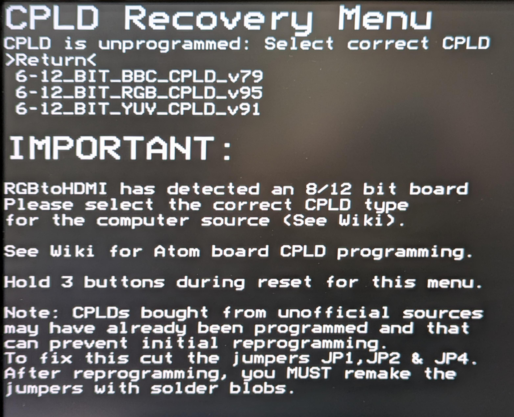
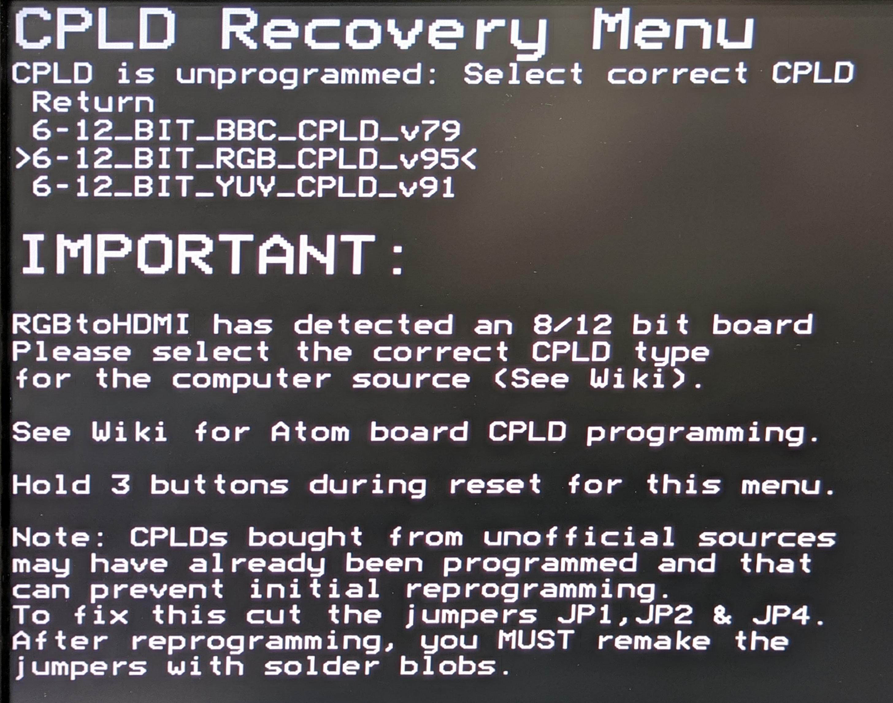
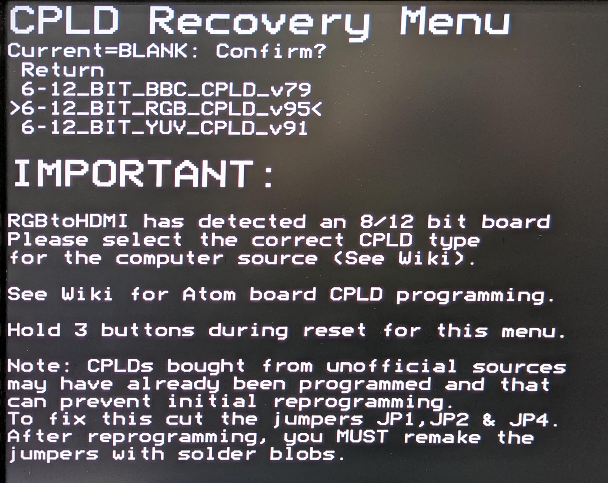
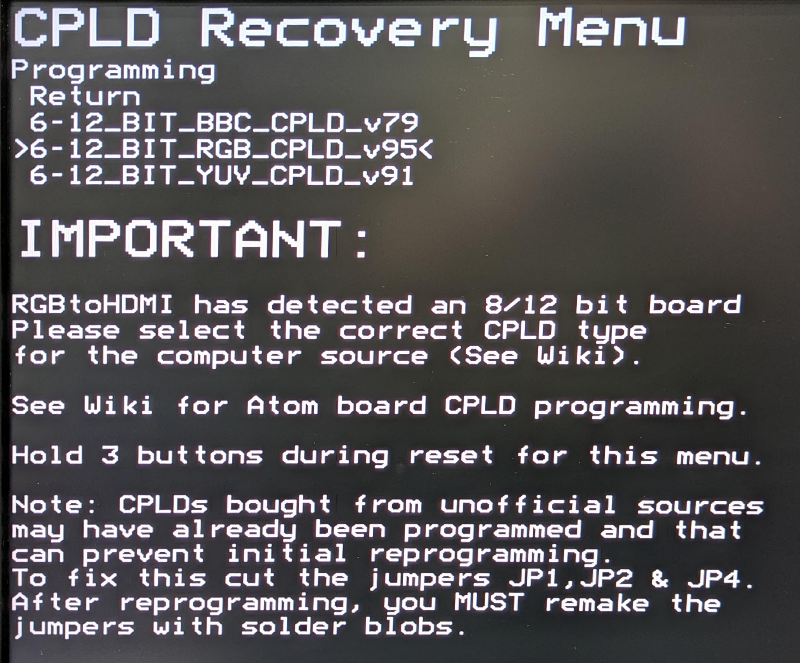
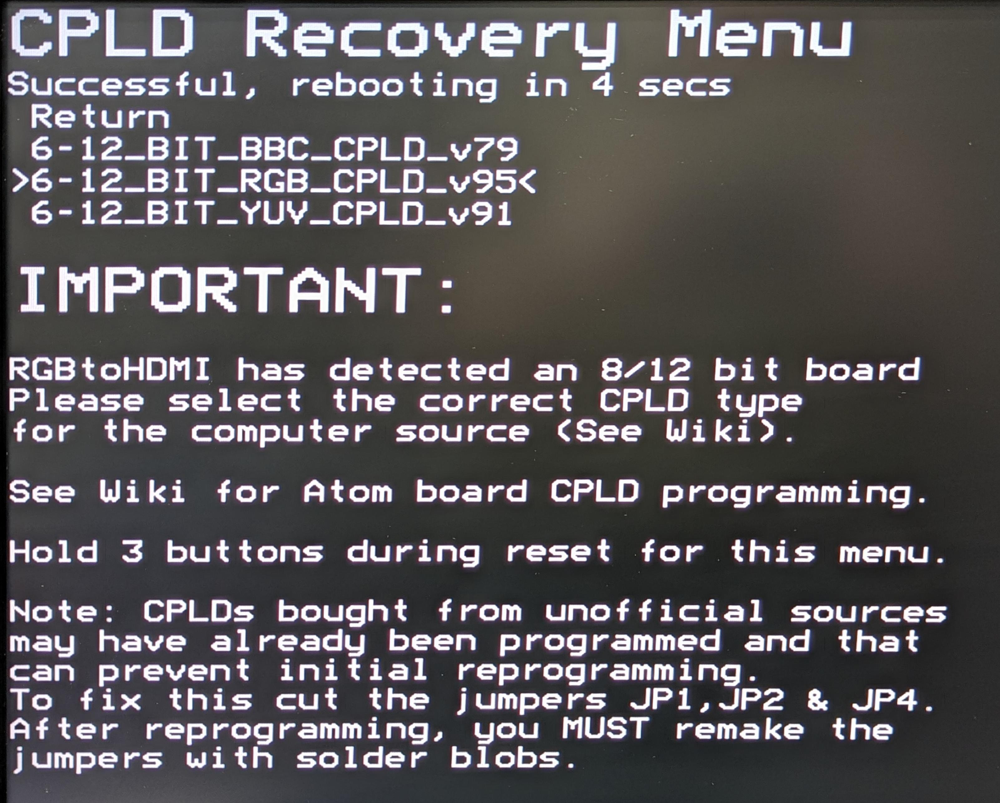
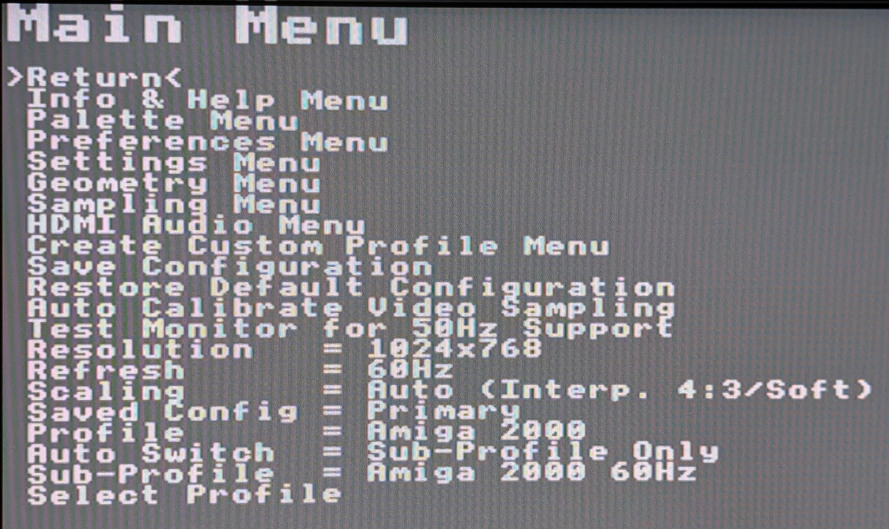
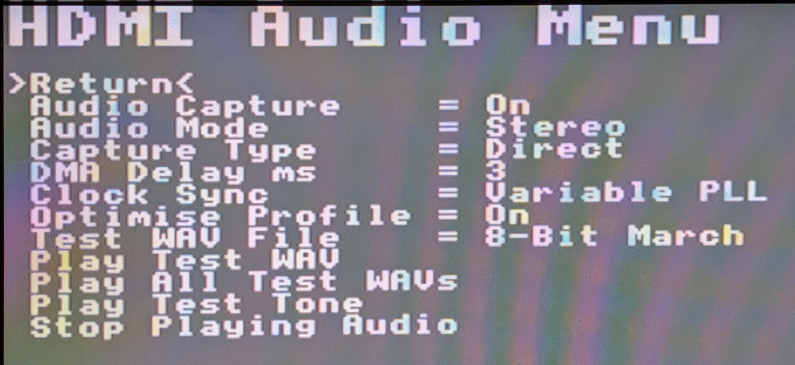
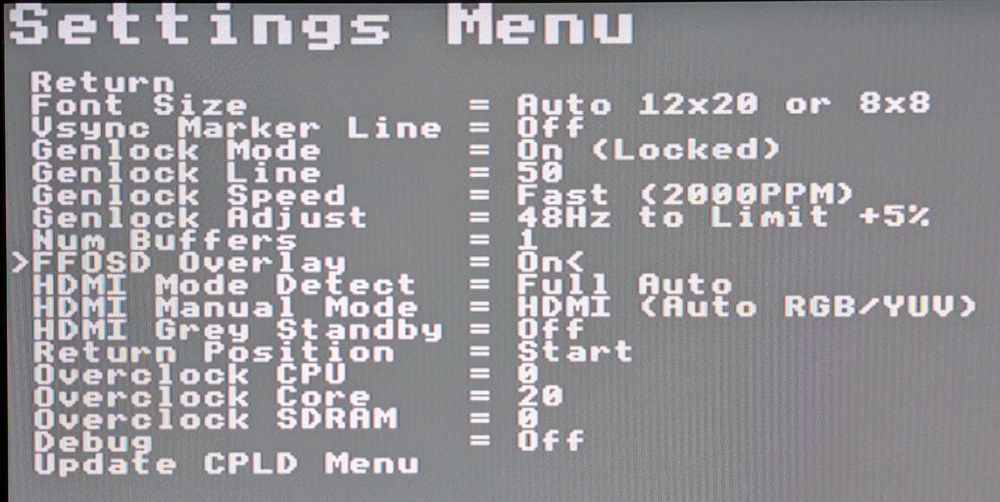
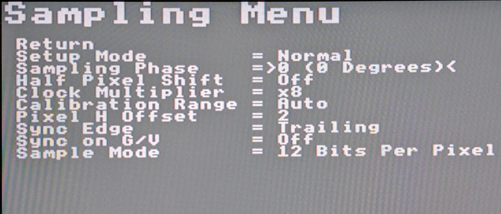
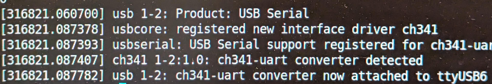

# Hardware Configuration

This document describes the configuration of both the Amiga AV to HDMI board and the software running on its Raspberry Pi and STM32.

## Configuration components

1. **Amiga AV to HDMI jumper settings**
   - Configure audio and OSD interaction
   - Enable FlashFloppy enhanced mode
   - Force secondary HDMI input to the rear connector

2. **RGBtoHDMI on the Raspberry Pi**
   - Captures and processes the Amiga video.
   - Processes the digital Amiga audio.
   - Generates the HDMI signal containing both video and audio.
   - Provides an on-screen display to allow configuration changes.

3. **FlashFloppy OSD firmware on the board's STM32F103**
   - Receives FlashFloppy display information.
   - Generates the FlashFloppy On-Screen display which is fed to the Pi.
   - Provides Amiga keyboard control of FlashFloppy.

4. **FlashFloppy on the Gotek**
   - Emulates the Amiga floppy drive.
   - Provides the display/I2C interface used by FlashFloppy OSD.

## Amiga AV to HDMI jumper settings

Follow the [Amiga Install](amiga_install.md) guide for details on jumper settings.

## RGBtoHDMI on the Raspberry Pi

The Raspberry Pi runs the [RGBtoHDMI](https://github.com/hoglet67/RGBtoHDMI) software.

Follow the RGBtoHDMI documentation for information on SD card preparation including RGBtoHDMI software installation. The general steps are:
1. Format an SD Card with FAT32. You must start with a blank card.
2. Download the [latest release](https://github.com/IanSB/RGBtoHDMI/wiki/Latest-Software) of the RGBtoHDMI software. You may need a beta release for audio support.
3. Extract the zip file directly to the SD Card. No modifications are necessary.
4. Unmount and eject the SD Card.

If you are setting up a new Amiga AV to HDMI, when the RGBtoHDMI software boots, it will first detect the CPLD is not programmed and give you options to select firmware for the device.



Use the buttons on the rear of the Amiga AV to HDMI to select the RGB_CPLD image. Press the bottom button twice:



Then press the top button:



Press the top button again:



It will erase and then program the CPLD, and then reboot.



After the Pi has rebooted, the RGBtoHDMI will begin showing video, but might not be correctly showing the Amiga video display. Press the top button and you should see the following menu:



There are a number of settings you will need to make.

1. Use the bottom button to move the cursor to **Profile**.
2. Press the top button to select.
3. Use the bottom and middle butons locate the "Amiga 2000" profile.
4. Press the top button to lock in the "Amiga 2000" profile.
5. Press the bottom button twice to select **Sub-Profile**.
6. Again use the bottom and middle buttons to locate the "Amiga 2000 60Hz" or "Amiga 2000 50Hz" profile, depending on your hardware.
7. Press the top button.
8. Press the middle button to go to **HDMI Audio Menu**.
9. Press the top button.

This will bring you to the HDMI Audio Menu.



Verify that **Audio Capture** is On, and verify the other settings match what you see here. If you would like to test that your Monitor / TV support audio through HDMI, now is a good time to test that. Press the down button until you reach **Play Test WAV** and press the top button. You should hear audio from your speakers. If you do not hear audio, yet you see video, the problem would be the protocol between the Pi and your monitor. Consult the [RGBtoHDMI](https://github.com/hoglet67/RGBtoHDMI) documentation for help. Once you are satisfied, you can stop the audio by scrolling down to **Stop Playing Audio** and press the top button. Press the down button one more time to go the the top of the menu and then the top button to select **Return**.

Back at the **Main Menu**, select **Settings Menu**:



Ensure that **HDMI Manual Mode** is set to HDMI (Auto RGB/YUV). If not scroll to that item, press the top button, and then scroll to this setting.

Verify that **FFOSD Overlay** is On. If not, and you intend to use FlashFloppy OSD, turn it on now. Then **Return** to the Main Menu.

If you notice fringing or glitching in the HDMI display of Amiga video, you may be able to adjust the sampling phase to remove it. At the Main Menu, select **Sampling Menu**.



Scroll down to **Sampling Phase** and select it. The phase is usually not very far off. Usually less than 6 steps is normal. Once done, return to the Main Menu one more time.


This time scroll down to **Save Configuration** and select that. After doing this step, the RGBtoHDMI will remember the settings that you've made the next time you power on your Amiga. Select **Return** to show just Amiga video. If you made major changes, the RGBtoHDMI might require a self-reboot before showing Amiga video.

## FlashFloppy OSD

The board's STM32 communicates with a FlashFloppy Gotek using the FlashFloppy OSD. Refer to the [FlashFloppy OSD](flashfloppy_osd.md) documentation for detailed programming and setup instructions.

## FlashFloppy

For general FlashFloppy setup, see:

- [FlashFloppy Initial Setup](https://github.com/keirf/flashfloppy/wiki/Initial-Setup)
- [FlashFloppy OSD Hardware Connections](https://github.com/keirf/flashfloppy-osd/wiki/Hardware-Connections)

FlashFloppy configuration files such as `FF.CFG` control FlashFloppy itself. They are not configuration files for RGBtoHDMI.

The FlashFloppy documentation notes that `FF.CFG` controls drive emulation and display handling, and that configuration files can be placed in the `FF/` directory or at the root of the USB drive. If an `FF/` directory exists, the root is not searched for those files.

## Recommended FlashFloppy configuration

Use a current [FlashFloppy](https://github.com/cdhooper/flashfloppy-osd-avhdmi/releases) release.

The FlashFloppy OSD interface is separate from the FlashFloppy drive configuration. Consult FlashFloppy documentation for more information.

## Button configuration

See the RGBtoHDMI documentation for button assignment and menu configuration.
The rear of the Amiga AV to HDMI provides three buttons.

- The top button enters the menu and selects items
- The middle button selects the previous item or decreases a value.
- The bottom button selects the next item or increases a value.

## STM32 firmware (FlashFloppy OSD)

Install the board-specific firmware from:

[cdhooper/flashfloppy-osd-avhdmi](https://github.com/cdhooper/flashfloppy-osd-avhdmi)

[Pre-compiled release binaries](https://github.com/cdhooper/flashfloppy-osd-avhdmi/releases) are available.

See [FlashFloppy OSD](flashfloppy_osd.md) for build and programming instructions.

## USB-C CH340 serial interface

Rev7 and later include a CH340 USB-to-serial interface for the STM32.

This is useful for development, programming, and diagnostics of the FlashFloppy OSD.

While configuring the FlashFloppy OSD or updating firmware, it's useful to connect the USB-C port to your PC.
- If you are running Windows, it's necessary to install the CH340 driver. When the CH340 is detected, it will create a COM port which you can find in the Device Manager.
- Linux natively supports the CH340, and will create a /dev/ttyUSBX device when the CH340 is detected. Use the following command after inserting the USB cable to determine which Linux device has been mapped to the CH340:

```
    sudo dmesg | tail
```

Example:



## Testing

After all hardware has been installed and configured:
1. Verify that the RGBtoHDMI provides an accurate HDMI capture of your Amiga video.
2. Verify that Amiga audio is routed to your monitor's speakers.
3. Verify that the FlashFloppy appears when you change to a different FlashFloppy disk image..
4. Verify that Amiga keyboard input works by pressing Ctrl-Alt-Del to turn on/off the OSD display.
5. Verify that the secondary HDMI input works by either setting jumper J5 or by pressing the DFU button on the Amiga AV to HDMI or by pressing Ctrl-Alt-2 on the Amiga keyboard.
